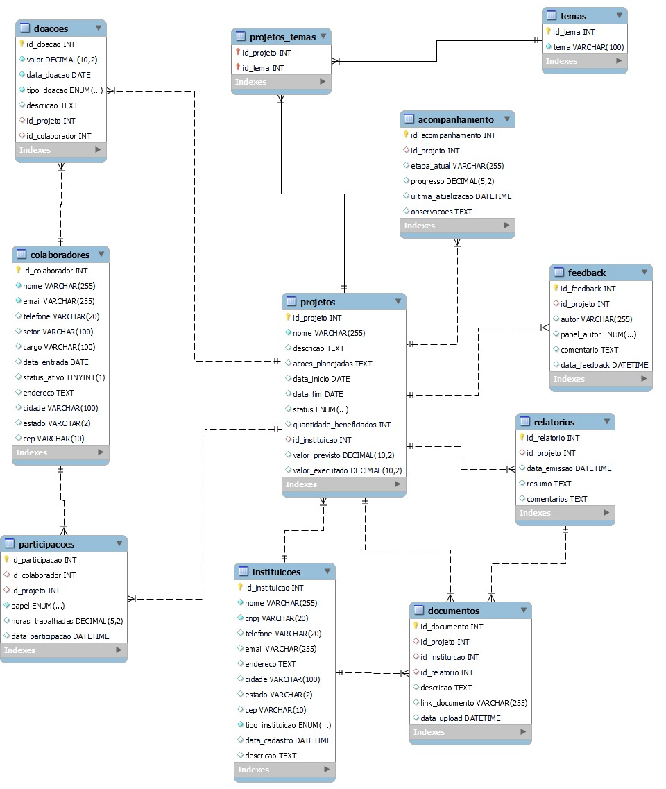

# Programa Fortificar - Sistema de Gerenciamento de Projetos Sociais 💻📚

## Descrição do Sistema 
O sistema foi desenvolvido para gerenciar o **Programa Fortificar** da **Fortes Engenharia**, que centraliza e organiza ações sociais da empresa. Ele permite acompanhar projetos sociais, doações realizadas, instituições beneficiadas e a participação de colaboradores. 

O sistema é otimizado para gerar relatórios e dashboards detalhados, proporcionando insights estratégicos para o planejamento e a gestão do programa.

---

## Funcionalidades Principais

### **1. Cadastro e Gerenciamento de Colaboradores**
- Armazena informações detalhadas de colaboradores, incluindo:
  - Nome, e-mail, telefone e cargo.
  - Endereço completo (CEP, cidade e estado).
  - Status ativo/inativo.
- Permite associar colaboradores a projetos e doações.

### **2. Cadastro de Instituições**
- Registra informações sobre as instituições beneficiadas:
  - Nome, CNPJ, endereço e contato.
  - Tipo da instituição (OSC, ONG, pública, etc.).
  - Descrição detalhada sobre a atuação.

### **3. Gerenciamento de Projetos**
- Cadastra projetos sociais com informações completas:
  - Nome, descrição, ações planejadas, quantidade de beneficiados.
  - Valores financeiros (previsto e executado).
  - Status (Planejado, Em execução, Concluído, Cancelado).
- Associa projetos a temas e instituições.

### **4. Controle de Doações**
- Registra doações feitas por colaboradores, vinculando-as a projetos.
- Detalha o tipo de doação (financeira, bens, serviços) e sua finalidade.

### **5. Monitoramento de Participação**
- Registra a participação dos colaboradores nos projetos:
  - Papel desempenhado (coordenador, voluntário, etc.).
  - Horas trabalhadas.
  - Data de participação.

### **6. Relatórios e Feedback**
- Gera relatórios detalhados de cada projeto, com:
  - Resumos e comentários.
  - Dados de progresso e resultados.
- Registra feedbacks de beneficiários, colaboradores e instituições.

### **7. Armazenamento de Documentos**
- Centraliza documentos associados a projetos, instituições e relatórios.
- Inclui links ou arquivos com informações relevantes.

---

## Estrutura do Banco de Dados

### **Entidades**
- **Colaboradores**: Cadastro de pessoas envolvidas no programa.
- **Instituições**: Registro de instituições beneficiadas.
- **Projetos**: Gerenciamento de ações sociais.
- **Temas**: Categorias de atuação (saúde, educação, etc.).
- **Doações**: Controle de doações recebidas.
- **Participações**: Registro da atuação de colaboradores em projetos.
- **Relatórios**: Relatórios de progresso e impacto dos projetos.
- **Acompanhamento**: Monitoramento detalhado do progresso.
- **Feedback**: Comentários e avaliações sobre os projetos.
- **Documentos**: Arquivos e links associados a projetos e instituições.

### **Relacionamentos**
1. **Colaboradores ↔ Doações**: Um colaborador pode fazer várias doações.
2. **Colaboradores ↔ Participações**: Um colaborador pode participar de vários projetos.
3. **Instituições ↔ Projetos**: Uma instituição pode estar associada a vários projetos.
4. **Projetos ↔ Temas**: Um projeto pode ter múltiplos temas.
5. **Projetos ↔ Relatórios**: Um projeto pode ter múltiplos relatórios.
6. **Projetos ↔ Feedback**: Um projeto pode receber feedback de várias partes.
7. **Projetos, Instituições e Relatórios ↔ Documentos**: Relacionados para armazenar documentos.

---

## Diagrama Entidade-Relacionamento (DER)
O diagrama abaixo ilustra a estrutura do banco de dados e os relacionamentos entre as entidades.

---

